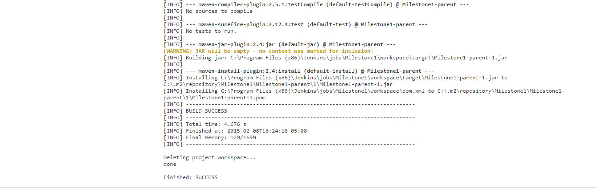

Milestone 1- CSC591 DevOps
----------------------

Project Team Members:

1] Priyanka Shankaran (priyan)

2] Smitha Sathyanarayana (ssathya)

###Build Section
-------------------------------

Our build server has been setup by configuring Jenkins. 
The Windows version of Jenkins has been installed, on our local machine, on port 8080. Using the web GUI of Jenkins, we have configured the features required for this milestone. The steps below describe each capability of the build server:

****Step 1: The ability to trigger a build in response to a git commit via a git hook.****

1] On Jenkins' side- GitHub plugin and Git plugin were installed.

2] On the Git repository side (remote)- The Jenkins Git plugin was installed.

3] Using the Jenkins GUI, we created a new project 'Milestone1', and linked it to one of our GitHub repositories.

4] We have configured polling on Jenkins and set it to 8 minutes. Every 8 minutes, Jenkins checks if there are any recent commits to the GitHub repository. Only if changes are found, Jenkins automatically kicks off a build. Thus the task is accomplished by configuring Jenkins using git hooks.

---------------
****Step 2: The ability to setup dependencies to a project and restore to a clean state.****

1] We have installed and configured Maven to install dependencies automatically. Maven reads a pom.xml file, which lists the dependencies of the project. A pom.xml file has been added to our repository with the required dependencies. 

2] The workspace cleanup plugin is used to restore the project to a clean state. After each build the workspace is cleaned up.

3] The screenshots below shows the console output, confirming that the dependencies have been set up and the project is restored to a clean state after the build.

****Step 3: The ability to execute a build script (e.g.: shell, maven).****

1] We configured the 'Execute the Windows batch command' option for the project with the shell script 'myshell.sh'.

2] A shell script called myshell.sh has been placed in our GitHub repository. As the script executes, it clones a GitHub repository to the workspace, and print some sample statements to the console.

****Step 4: The ability to run a build on multiple nodes.****

1] We have configured Jenkins slaves using the 'Manage Node' option on the Jenkins GUI. We have created a single slave called 'Slave1', as shown in the screenshot below.

2] We have installed the Node and Label Parameter plugin. Through this, we could configure Jenkins to use all possible online nodes to run a build.

The screenshot below explains our configuration:

3] In the next screenshot, we can see that by executing a single build on the same project, two seperate builds were kicked off on the master and slave. 

4] We also initiated two different builds concurrently on two seperate projects. Jenkins delegated the builds to a master and a slave and both builds succeeded concurrently. This can be seen in the screenshot below:

****Step 5: The ability to retrieve the status of the build via http.****

1] We have used the inbuilt capability of Jenkins to check the status of our builds. The screenshots below show us the status for the project and also on clicking the links, we will be able to see the status of individual builds.

----------------------------

###Configuration Files and Code
----------------------------------
The configuration file (config.xml) as well as all the code (for the project being built), the file specifying dependencies (pom.xml), and the shell script (myshell.sh), has been placed in the repository.